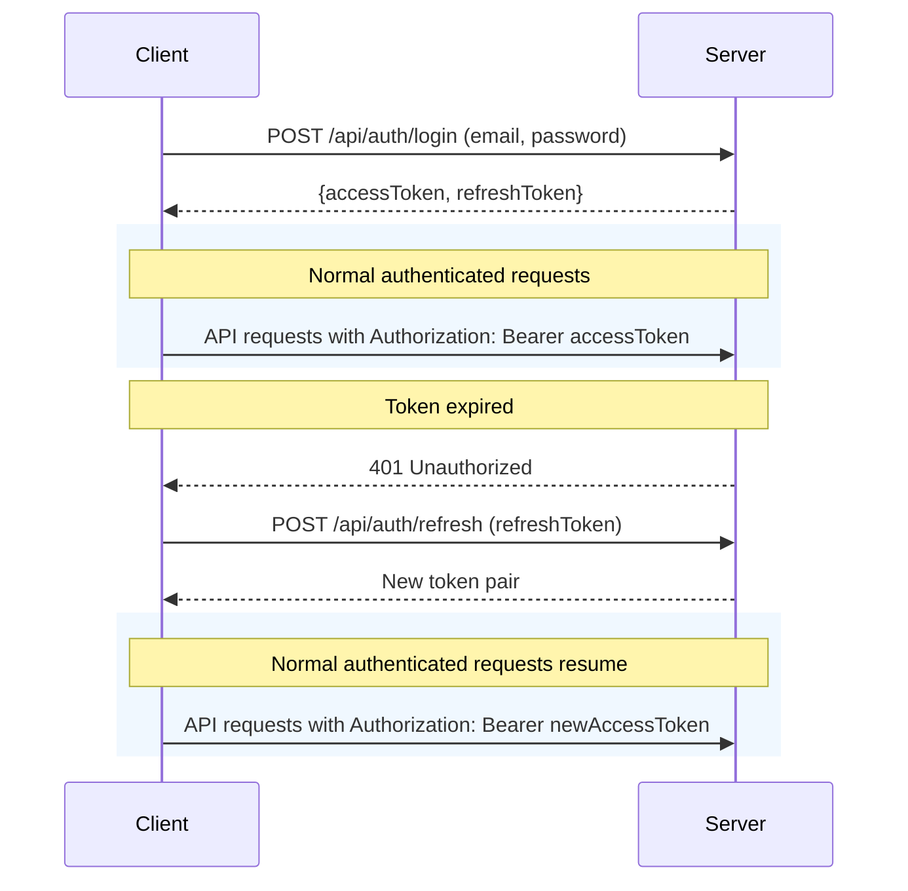

# 💰 Expense Tracker API


A modern expense tracking system with secure JWT authentication, receipt OCR processing, and comprehensive financial analytics.

## 🌟 Features

- **Dual-Token Authentication** (Access + Refresh tokens)
- **Receipt Processing** with OCR technology
- **Expense Analytics** with interactive dashboards
- **RESTful API** following best practices
- **Swagger Documentation** for easy testing
- **Docker-ready** for seamless deployment

## 🚀 Quick Start

### Prerequisites
- Java 21
- PostgreSQL 16
- Maven 3.9+

### Installation
```bash
git clone https://github.com/yourusername/expense-tracker.git
cd expense-tracker/backend
mvn spring-boot:run
```

# 🔐 Authentication Flow


# 📚 API Documentation

Explore the API with Swagger UI:
```
http://localhost:8080/swagger-ui.html
```

# 🛠️ Configuration
Environment Variables
```properties
# Database
SPRING_DATASOURCE_URL=jdbc:postgresql://localhost:5432/expense_tracker
SPRING_DATASOURCE_USERNAME=youruser
SPRING_DATASOURCE_PASSWORD=yourpass

# JWT
JWT_SECRET=your-256-bit-secret
JWT_ACCESS_EXPIRATION=900000 # 15 mins
JWT_REFRESH_EXPIRATION=86400000 # 24 hours
```

## Profiles

| Profile | Description |
|---------|-------------|
| dev     | Development settings with debug logging |
| prod    | Production-optimized configuration |

# 🐳 Docker Deployment

## dev environment
```bash
docker compose -f docker-compose.yml -f docker-compose-dev.yml up --build
```

## prod environment
```bash
docker compose -f docker-compose.yml -f docker-compose-prod.yml up --build
```

## Access services:
- API: http://localhost:8080
- PostgreSQL: 5432

# 📦 Project Structure

```text
expense-tracker/
├── backend/
│   ├── src/
│   │   ├── main/java/com/expensetracker/
│   │   │   ├── auth/           # Authentication logic
│   │   │   ├── config/         # App configuration
│   │   │   ├── controller/     # API endpoints
│   │   │   ├── model/          # Database entities
│   │   │   ├── repository/     # Data access layer
│   │   │   └── service/        # Business logic
│   │   └── resources/
│   │       ├── application.properties
│   │       └── application-{profile}.properties
├── frontend/                   # React application
└── docker-compose.yml
└── docker-compose-dev.yml
```

# 📈 Built With

- Backend: Spring Boot 3, Hibernate, JWT
-Frontend: React, Vite, Chart.js
-Database: PostgreSQL 16
-Infra: Docker, HikariCP

# 🤝 Contributing
1. Fork the project
2. Create your feature branch (`git checkout -b feature/AmazingFeature`)
3. Commit your changes (`git commit -m 'Add some amazing feature'`)
4. Push to the branch (`git push origin feature/AmazingFeature`)
5. Open a Pull Request

# 📜 License
Distributed under the MIT License. See `LICENSE` for more information.

#

<p align="center"> Made with ❤️ by Yash | <a href="https://github.com/YD-S">GitHub</a> | <a href="https://linkedin.com/in/yashdev-singh/">LinkedIn</a> </p>